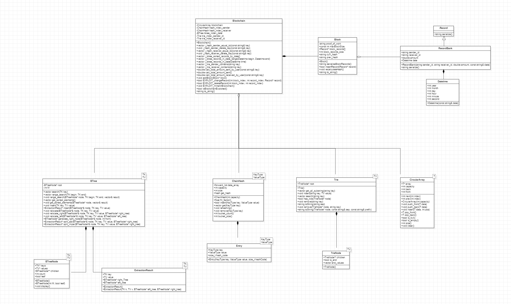

# Project: First Delivery

## Introduction

The vast amount of virtual information generated daily has made it essential to create new forms of storage that are secure enough to be trusted with extremely sensitive data.

## Blockchain

The blockchain is a data structure in which new information can be added in the form of blocks.

Each block has a hash created from its content and metadata of the previous block. If any information in a block is changed, the subsequent blocks will show the existence of a discrepancy.

## Importance

A structure like the blockchain is important because, if implemented correctly, it provides a way to store information in an immutable manner. Any attempt to modify the information would be reflected in the entire structure.

In this way, it can be used to store valuable information such as banking transactions or personal data of individuals held by a government.

## Use Case

In this instance, we have decided to use the blockchain to store valuable information for a banking company. Each record will contain data such as the sender, receiver, amount, and date of the transaction.

This use case has been chosen because it represents a situation where the data structure needs to be tamper-proof or its integrity needs to be validated at any time.

## Proof of Work

If someone wants to change the information in a block that has already been validated and has sufficient computational power, they could quickly modify the structure to eliminate any discrepancies before anyone notices.

To prevent this in our implementation, each time a block is generated, a random number is chosen from a secret range called the proof of work.

The purpose of this number is to ensure that a block is only considered valid if the first n digits of its hash match the proof of work.

However, it is highly unlikely that a block will be valid on the first attempt to calculate its hash. Additional unique information, also known as a nonce, needs to be added, and the hash needs to be recalculated until it meets the validity criteria.

This process will take time proportional to the number of digits in our proof of work, as more attempts will be needed to "guess" it.

## Implementation

### Record Class

- An abstract class that allows storing data based on its derived classes' implementation.
- Can be serialized, meaning its information can be represented as text.

### Block Class

- Allows storing a maximum number of Records as desired by the user of our structure.
- These records are stored in an array of pointers to Records.
- Each time a new Record is added, the block's hash changes because its information has been modified.

### Blockchain Class

- Stores each of the added Blocks within a Circular Array of pointers to blocks.
- To add a block, it is first mined, meaning the proof of work process is performed, and then it is added.
- Includes educational methods that allow exploiting the structure itself to demonstrate how discrepancies would appear if someone attempts to compromise it.

### Circular Array

- A data structure that stores the blocks of the blockchain.

### B Tree

- An index dedicated to dates and amounts of records.

### ChainHash

- An index dedicated to the names of all users.

### Trie

- An index dedicated to the names of all users.

## Complexity Analysis

- Insert Block: Using a circular array, pushing back a new block is done in O(1) time. However, if the circular array runs out of space, a resize operation is required, resulting in O(n) time complexity.

- Access Block: Always O(1) since it uses random access like an array.

- Exploit Modify or Delete Block: Accessing a record in a specific block has a complexity of O(1).

- Exploit Mine the Entire Blockchain: In the worst case, when the genesis block has been modified, the entire blockchain needs to be regenerated.

